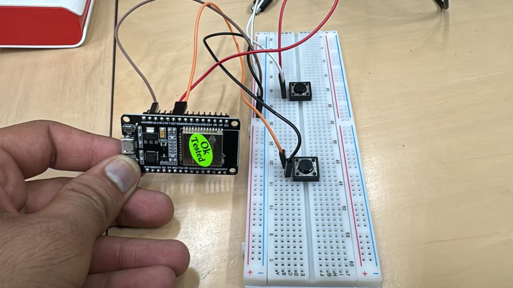

# ESP32 BLE Presenter Remote

## Overview

This project implements a Bluetooth Low Energy (BLE) presentation remote using an ESP32 microcontroller. The device acts as a wireless HID (Human Interface Device) keyboard that can send left and right arrow key presses to control presentation slides on paired devices.

## Schematic



## Features

- **BLE HID Device**: Emulates a keyboard using Bluetooth Low Energy
- **Two Button Control**:
  - Next slide (Right arrow key)
  - Previous slide (Left arrow key)
- **Automatic Pairing**: Supports BLE bonding with paired devices
- **Battery Level Reporting**: Reports 100% battery level to connected devices
- **Auto-reconnection**: Automatically restarts advertising when disconnected

## Hardware Requirements

- ESP32 development board
- 2 Push buttons
- Pull-up resistors (if not using internal pull-ups)
- Breadboard and jumper wires

## Pin Configuration

| Function | GPIO Pin | Notes |
|----------|----------|-------|
| Next Button | GPIO 27 | Active LOW with internal pull-up |
| Previous Button | GPIO 26 | Active LOW with internal pull-up |

## Software Architecture

### Core Components

1. **BLE Stack Initialization**
   - Initializes ESP32's Bluetooth controller
   - Configures BLE-only mode (Classic Bluetooth disabled)
   - Sets up Bluedroid stack

2. **HID Device Configuration**
   - Device Name: "ESP32 Presenter"
   - Vendor ID: 0x16C0
   - Product ID: 0x05DF
   - Appears as a standard keyboard to host devices

3. **Security and Pairing**
   - Uses bonding for persistent connections
   - No passkey required (ESP_IO_CAP_NONE)
   - Automatic acceptance of pairing requests

4. **Button Handling**
   - Polling-based button detection (25ms interval)
   - Software debouncing
   - Sends HID keyboard reports for arrow keys

### Key Functions

#### `app_main()`

- Initializes NVS flash storage
- Sets up Bluetooth and BLE stack
- Configures HID device
- Sets security parameters
- Starts advertising
- Creates button monitoring task

#### `button_task()`

- Monitors GPIO pins for button presses
- Implements debouncing logic
- Triggers key send operations

#### `send_key(uint8_t keycode)`

- Sends HID keyboard reports
- Handles key press and release sequences
- Validates connection status before sending

#### `hidd_event_callback()`

- Handles HID device events (connect/disconnect)
- Manages advertising state
- Updates connection status

#### `esp_gap_cb()`

- Handles BLE GAP events
- Manages advertising lifecycle
- Processes security/pairing events

## Build and Flash Instructions

### Prerequisites

- ESP-IDF development framework (v4.4 or later)
- Configured ESP-IDF environment

### Build Steps

```bash
# Navigate to project directory
cd /path/to/presenter

# Set target (if not already set)
idf.py set-target esp32

# Build the project
idf.py build

# Flash to device
idf.py flash

# Monitor output (optional)
idf.py monitor
```

## Usage

1. **Hardware Setup**
   - Connect buttons between GPIO 27/26 and GND
   - Power the ESP32

2. **Pairing**
   - The device will appear as "ESP32 Presenter" in Bluetooth settings
   - Pair with your computer/device
   - No PIN required

3. **Operation**
   - Press the button connected to GPIO 27 for next slide (right arrow)
   - Press the button connected to GPIO 26 for previous slide (left arrow)

## Technical Specifications

### BLE Advertising Data

- Device Name: "ESP32 Presenter"
- Service UUID: 0x1812 (HID Service)
- Appearance: 0x03C1 (Keyboard)

### HID Report Descriptor

- Standard keyboard report format
- 8-byte reports: [modifier, reserved, key1, key2, key3, key4, key5, key6]
- Supports modifier keys and 6 simultaneous key presses

### Timing Characteristics

- Button polling interval: 25ms
- Key press duration: 20ms
- Advertising intervals: 20-40ms

## Dependencies

The project requires the following ESP-IDF components:

- `bt` - Bluetooth stack
- `esp_driver_gpio` - GPIO driver
- `esp_hid` - HID device support
- `nvs_flash` - Non-volatile storage
- `freertos` - Real-time operating system

## Troubleshooting

### Connection Issues

- Ensure device is in pairing mode
- Clear Bluetooth cache on host device
- Check ESP32 logs for connection status

### Button Not Responding

- Verify GPIO connections
- Check button wiring (active LOW configuration)
- Monitor logs for button press detection

### Build Errors

- Verify ESP-IDF installation and environment
- Check component dependencies in CMakeLists.txt
- Ensure target is set correctly

## Code Statistics

- **Lines of Code**: ~400 lines
- **Functions**: 6 main functions
- **GPIO Pins Used**: 2
- **Memory Usage**: Optimized for ESP32 constraints
- **Real-time Tasks**: 1 (button monitoring)

## Future Enhancements

Potential improvements for this project:

- Battery level monitoring with ADC
- Deep sleep mode for power conservation
- Additional button functions (volume, page up/down)
- OLED display for status indication
- Over-the-air (OTA) firmware updates
- Custom HID report descriptors for multimedia keys

## License

This project is developed for educational and personal use. Modify and distribute according to your needs.
